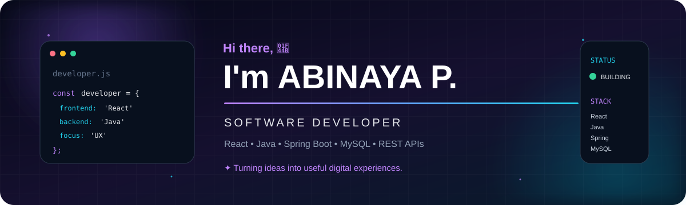

 

&nbsp;

&nbsp;

 

CODE   BUILD   IMPROVE   REPEAT 🚀

<table>
<tr>
<td width="58%" valign="top">

👩‍💻 ABOUT ME

I'm Abinaya P., a B.Tech Information Technology graduate and React + Java Developer.

I enjoy turning real-world problems into practical digital solutions — from polished frontend experiences to Java APIs, database integration and enterprise workflows.

✦ I enjoy building

⚛️ Modern React interfaces

☕ Java & Spring Boot applications

🔗 REST APIs and database integrations

🎨 Clean UI/UX experiences

🧠 Practical solutions to real problems

</td>

<td width="42%" valign="top">

⚡ QUICK SNAPSHOT

💻 Role

React + Java Developer

🎯 Focus

Frontend + Backend

⚛️ Frontend

React / TypeScript

☕ Backend

Java / Spring Boot

🗄️ Database

MySQL / MongoDB

🧠 Learning

DSA / System Design

🎨 Interest

UI/UX / Product Thinking

</td>
</tr>
</table>

🧩 MY TECH UNIVERSE

 

  

🚀 SELECTED WORK

<table>
<tr>
<td width="33%" valign="top">

🏦 KUBER

Treasury Management

React Java REST APIs MySQL

Enterprise treasury workflows, master modules, APIs and business-focused UI.

</td>

<td width="33%" valign="top">

🤖 AI PPE

Safety Monitoring

YOLOv8 Python Flask MySQL

Computer-vision based PPE detection and real-time safety monitoring.

</td>

<td width="33%" valign="top">

📦 INVENTORY

Management System

Java Spring Boot React MySQL

Full-stack inventory management for products, stock and business operations.

</td>
</tr>
</table>

🧠 MY BUILDING PROCESS

 

<table>
<tr>
<td align="center">👀 <b>OBSERVE</b></td>
<td>→</td>
<td align="center">🔎 <b>UNDERSTAND</b></td>
<td>→</td>
<td align="center">🎨 <b>DESIGN</b></td>
<td>→</td>
<td align="center">💻 <b>BUILD</b></td>
<td>→</td>
<td align="center">✨ <b>IMPROVE</b></td>
</tr>
</table>

 

<blockquote>
<b>Don't just build features. Build solutions.</b>
</blockquote>

<table>
<tr>
<td width="50%" valign="top">

🌱 CURRENTLY LEARNING

⚛️ Advanced React & component architecture

☕ Advanced Java & Spring Boot

🏗️ System design fundamentals

🧠 DSA & problem solving

🎨 UI/UX & creative product design

</td>

<td width="50%" valign="top">

🎯 MY DIRECTION

Clean UI
   +
Reliable APIs
   +
Useful products
   +
Better UX
   ↓
Software people enjoy using

</td>
</tr>
</table>

📈 GITHUB

 

&nbsp;

  

Your GitHub contribution graph and activity are shown automatically on your profile.

🌐 LET'S CONNECT

 

  

Code. Build. Improve. Repeat. 🚀

 

