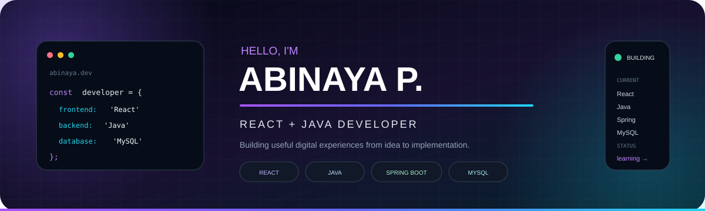

<div align="center">



<br>

<a href="https://abinayapandurangan.netlify.app/"></a>
<a href="https://www.linkedin.com/in/abinaya-pandurangan-6b2a22262/"></a>
<a href="https://github.com/Abi1274"></a>

</div>

<br>

<table>
<tr>
<td width="60%" valign="top">

## 👋 A LITTLE ABOUT ME

I'm **Abinaya P.**, a **React + Java Developer** who enjoys turning real-world problems into useful digital products.

I like working across the stack — creating clean interfaces on the frontend and building reliable APIs and database-driven features on the backend.

**I care about:**  
🎨 thoughtful UI & UX · 🧩 solving problems · 🚀 building useful things · 🌱 continuous learning

</td>

<td width="40%" valign="top">

### CURRENTLY LEARNING

```text
React
Advanced Java
Spring Boot
System Design
DSA
UI / UX
```

</td>
</tr>
</table>

<br>

<div align="center">

## ⚡ TECH STACK


<br><br>

`React` · `TypeScript` · `Java` · `Spring Boot` · `MySQL` · `REST APIs` · `Git`

</div>

<br>

## 🚀 FEATURED WORK

<table>
<tr>
<td width="50%" valign="top">

### 🏦 KUBER — Treasury Management

**React · Java · REST APIs · MySQL**

Enterprise treasury management platform involving financial workflows, master modules, APIs and business-focused UI.

**→ [View project](https://github.com/Abi1274/technocrats)**

</td>

<td width="50%" valign="top">

### 🤖 AI PPE Monitoring

**YOLOv8 · Python · Flask · MySQL**

Computer-vision based safety system designed for PPE detection and real-time monitoring.

**→ [View project](https://github.com/Abi1274/AI-Powered-PPE-Monitoring-and-Radiation-Safety-System)**

</td>
</tr>

<tr>
<td width="50%" valign="top">

### 📦 Inventory Management

**Java · Spring Boot · React · MySQL**

Full-stack application for managing products, inventory and business operations.

**→ [View project](https://github.com/Abi1274/Edubridge_Inventory-Management-System)**

</td>

<td width="50%" valign="top">

### 💡 More Experiments

I also keep smaller projects and experiments on GitHub while learning new concepts and improving my development skills.

**→ [Explore all repositories](https://github.com/Abi1274?tab=repositories)**

</td>
</tr>
</table>

<br>

<div align="center">

## 🧠 HOW I BUILD

**OBSERVE** → **UNDERSTAND** → **DESIGN** → **BUILD** → **IMPROVE**

<sub>I don't just want the feature to work — I want to understand the problem behind it and make the experience better.</sub>

</div>

<br>

<table>
<tr>
<td width="50%" valign="top">

## 🌱 RIGHT NOW

- ⚛️ Deepening React & component architecture
- ☕ Improving Java & Spring Boot
- 🏗️ Learning system design
- 🧠 Practicing DSA & problem solving
- 🎨 Exploring UI/UX and product thinking

</td>

<td width="50%" valign="top">

## 💻 MY DEVELOPER MINDSET

```text
Learn something
      ↓
Build something
      ↓
Break something
      ↓
Understand it
      ↓
Make it better
```

</td>
</tr>
</table>

<br>

<div align="center">

## 🌐 LET'S CONNECT

If you're building something interesting, I'd love to hear about it.

<br>

<a href="https://abinayapandurangan.netlify.app/"></a>
&nbsp;
<a href="https://www.linkedin.com/in/abinaya-pandurangan-6b2a22262/"></a>

<br><br>

<sub>Code. Build. Improve. Repeat. 🚀</sub>

</div>
