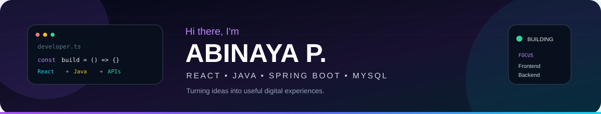
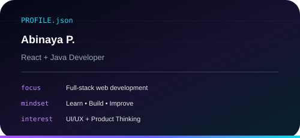
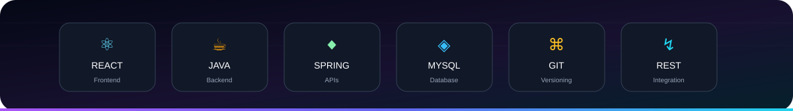
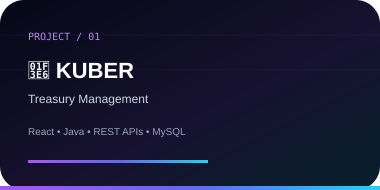
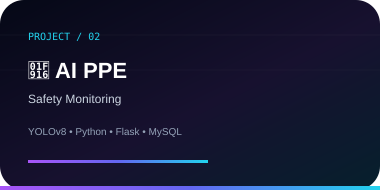
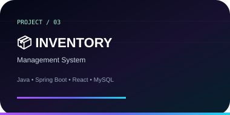
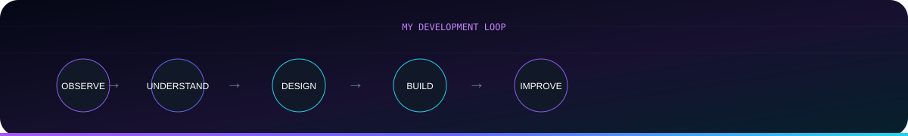

  

&nbsp;&nbsp;

  

 

<table>
<tr>
<td width="55%" valign="top">

## 👋 HELLO, I'M ABINAYA

**React + Java Developer**

I build web applications that connect a clean user experience with reliable backend systems.

I enjoy taking a problem, understanding how it works, designing a simple experience, and turning it into working software.

### `What I like building`

⚛️ React interfaces  
☕ Java & Spring Boot APIs  
🗄️ Database-driven applications  
🔗 REST API integrations  
🎨 UI/UX focused experiences  

</td>

<td width="45%" valign="top">

</td>
</tr>
</table>

 

## ⚡ TECH STACK

 

## 🚀 THINGS I'VE BUILT

<table>
<tr>
<td width="33%" valign="top" align="center">

</td>
<td width="33%" valign="top" align="center">

</td>
<td width="33%" valign="top" align="center">

</td>
</tr>
</table>

 

 

<table>
<tr>
<td width="50%" valign="top">

## 🌱 CURRENTLY LEARNING

- Advanced React
- Component architecture
- Java & Spring Boot
- DSA & problem solving
- System design
- UI/UX & product thinking

</td>

<td width="50%" valign="top">

## 🎯 MY APPROACH

> **Observe → Understand → Design → Build → Improve**

I don't want to just make a feature work.

I want to understand **why it exists**, make it easier to use, and keep improving it.

</td>
</tr>
</table>

 

  

 

  

&nbsp;&nbsp;

  

